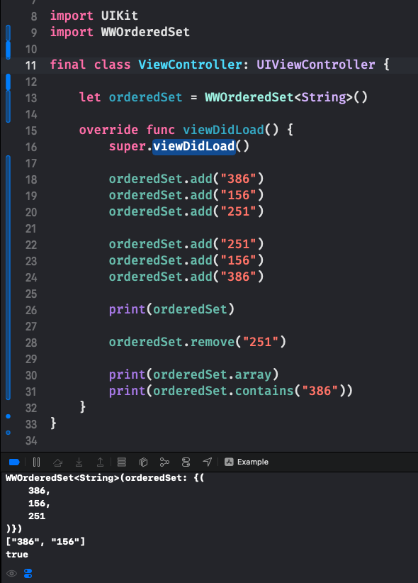

# WWOrderedSet
[](https://developer.apple.com/swift/) [](https://developer.apple.com/swift/)  [](https://developer.apple.com/swift/) [](https://developer.apple.com/swift/)

### [Introduction - 簡介](https://swiftpackageindex.com/William-Weng)
- [Make NSOrderedSet easier to use.](https://developer.apple.com/documentation/foundation/nsorderedset)
- [讓 NSOrderedSet 更容易使用。](https://www.cnblogs.com/muzijie/p/6479342.html)



### [Installation with Swift Package Manager](https://medium.com/彼得潘的-swift-ios-app-開發問題解答集/使用-spm-安裝第三方套件-xcode-11-新功能-2c4ffcf85b4b)
```bash
dependencies: [
    .package(url: "https://github.com/William-Weng/WWOrderedSet.git", .upToNextMajor(from: "1.0.1"))
]
```

### 可用參數 (Parameter)
|參數|功能|
|-|-|
|count|元素數量|
|array|元素陣列 (直接複製)|
|first|第一個元素|
|last|最後一個元素|

### 可用函式 (Function)
|函式|功能|
|-|-|
|add(_:)|增加內容元素|
|remove(_:)|刪除內容元素|
|remove(at:)|刪除某個位置的內容元素|
|removeAll(_:)|移除所有元素|
|object(at:)|取得某個元素|
|firstObject()|取得第一個元素|
|lastObject()|取得最後一個元素|
|contains(_:)|是否有包含該元素|
|index(of:)|尋找元素在哪個位置|

### Example
```swift
import UIKit
import WWOrderedSet

final class ViewController: UIViewController {

    let orderedSet = WWOrderedSet<String>()
    
    override func viewDidLoad() {
        super.viewDidLoad()
        
        orderedSet.add("386")
        orderedSet.add("156")
        orderedSet.add("251")
        
        orderedSet.add("251")
        orderedSet.add("156")
        orderedSet.add("386")
        
        print(orderedSet)
        
        orderedSet.remove("251")
        
        print(orderedSet.array)
        print(orderedSet.contains("386"))
    }
}
```
